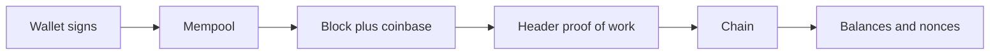

# Blockchain-first

A small account-based blockchain for learning how a chain refuses a forged transfer. You can mine a block, move coins between wallets you control, and sync two local nodes. A later, separate step is a fixed-supply token on a public testnet. That token is documented in [docs/MEME_COIN.md](docs/MEME_COIN.md) and [docs/DEPLOYMENT.md](docs/DEPLOYMENT.md). Coins on this Python chain are for the demo. They are not a listing, a bridge, or something to sell.

## What the node enforces

- Transfers are Ed25519 signatures over a domain-separated message. The signer is the account address (the hex public key).
- Amounts are integers. Each account has a nonce, so a captured transaction cannot be replayed.
- A block is valid only when its proof of work commits to the parent hash, the transaction bytes, and the difficulty.
- The only new coins are the block reward (50) plus fees, paid in the coinbase transaction. Genesis starts empty.
- Peers are opt-in. The node adopts a longer chain only after the same checks pass. Link-local and metadata addresses are rejected before a connection is opened.
- The HTTP server binds to `127.0.0.1`. State-changing routes are POST and require the header `X-Chain-Request: 1`. Set `CHAIN_API_TOKEN` before binding any other host.

The threat model, and the limits of a difficulty-capped proof of work, are in [docs/SECURITY.md](docs/SECURITY.md).



## Run it

From this directory:

```bash
python3 -m venv .venv
source .venv/bin/activate
pip install -r requirements.txt
pip install -r requirements-dev.txt
pytest
```

Create a wallet, then start the node. `new` writes a mode-0600 file and prints only the public address.

```bash
python -m chain.wallet new --out wallet.json
python blockchain.py
```

The node key lives at `data/node_key.json`. Block rewards go to that address, which `GET /node` returns. `data/` and `wallet.json` are gitignored.

In a second terminal, with the venv activated:

```bash
curl -s http://127.0.0.1:5000/node
curl -s -X POST -H 'X-Chain-Request: 1' http://127.0.0.1:5000/mine
python -m chain.client \
  --wallet data/node_key.json \
  --recipient "$(python -m chain.wallet address --wallet wallet.json)" \
  --amount 10 \
  --mine
curl -s "http://127.0.0.1:5000/account/$(python -m chain.wallet address --wallet wallet.json)"
```

The first `mine` creates 50 coins in the node wallet. The client signs a transfer of 10 with the next nonce and, because of `--mine`, asks the node to put that transfer in a block. The second block's reward also goes to the node wallet. The recipient's confirmed balance stays 0 until a block includes the transfer.

Environment variables are listed in [.env.example](.env.example). Every node that should accept each other's blocks has to use the same `CHAIN_DIFFICULTY` (default 4, maximum 5).

## A second node

```bash
CHAIN_PORT=5001 CHAIN_DATA_DIR=data-node2 python blockchain.py
```

Register it from the first node, mine on the second, then ask the first to sync:

```bash
curl -s -X POST \
  -H 'X-Chain-Request: 1' \
  -H 'Content-Type: application/json' \
  -d '{"nodes":["http://127.0.0.1:5001"]}' \
  http://127.0.0.1:5000/nodes/register

curl -s -X POST -H 'X-Chain-Request: 1' http://127.0.0.1:5001/mine
curl -s -X POST -H 'X-Chain-Request: 1' http://127.0.0.1:5000/nodes/resolve
```

`replaced` is true when the peer's chain is longer and every block checks out. A longer chain with a broken proof, a bad signature, or an inflated coinbase is ignored.

## HTTP API

Reads are open on localhost. Mutations need `X-Chain-Request: 1`. When `CHAIN_API_TOKEN` is set, mutations also need `Authorization: Bearer <token>`.

| Method | Path | Effect |
| --- | --- | --- |
| GET | `/health` | Length and difficulty |
| GET | `/node` | Miner address (public key only) |
| GET | `/chain` | Full chain |
| GET | `/mempool` | Queued transfers |
| GET | `/account/<address>` | Balance, confirmed nonce, next nonce |
| GET | `/nodes` | Registered peers |
| POST | `/mine` | Mine one block to the node wallet |
| POST | `/transactions/new` | Queue a signed transfer |
| POST | `/nodes/register` | Add peer origins (`{"nodes":["http://127.0.0.1:5001"]}`) |
| POST | `/nodes/resolve` | Adopt a longer valid peer chain |

`python -m chain` is the same process as `python blockchain.py`.

## Layout

| Path | Role |
| --- | --- |
| `chain/` | Blocks, signatures, balances, peer checks, HTTP node |
| `blockchain.py` | Process entrypoint |
| `tests/` | Supply, signatures, peer URLs, HTTP auth |
| `docs/SECURITY.md` | Threat model and operator rules |
| `docs/DEPLOYMENT.md` | Local node, then a testnet token, then a mainnet gate |
| `docs/MEME_COIN.md` | Naming worksheet and token shape |
| `contracts/FixedSupplyToken.sol` | EVM reference, fixed supply, no owner |

## Tests

```bash
ruff check .
python -m compileall -q .
pytest
python scripts/smoke.py
python scripts/check_runnable.py
```

The suite uses difficulty 1 so mining stays fast. The running node defaults to difficulty 4. `scripts/smoke.py` mines one block in-process. `scripts/check_runnable.py` builds the Flask app and requests `/health` without opening a port.

GitHub Actions runs those commands on pushes and pull requests to `main`. Dependabot opens weekly update pull requests for pip and GitHub Actions. CodeQL analyzes the Python on the same events and every Sunday.

## Where a meme coin fits

Pick the name and the supply with [docs/MEME_COIN.md](docs/MEME_COIN.md). Follow [docs/DEPLOYMENT.md](docs/DEPLOYMENT.md) through the local chain first, then a public testnet, and stop at the mainnet checklist until every line is true. The reference contract mints once and has no admin key.
